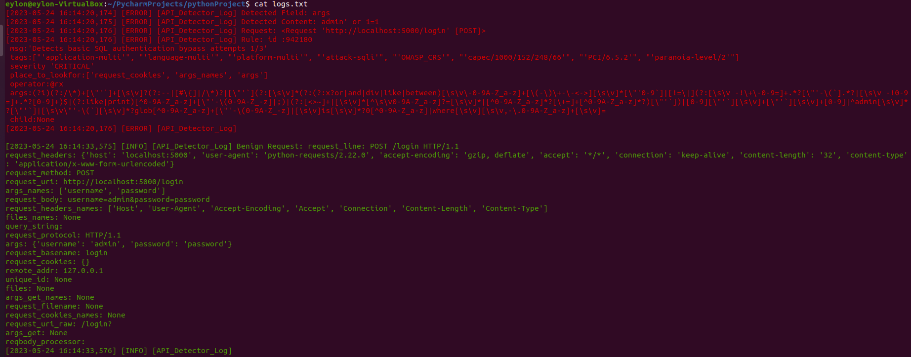

<!-- PROJECT LOGO -->
<br />
<div align="center">
  <a href="https://github.com/michaelMatve/API_Attack_Mitigation">
    
  </a>

  <h3 align="center">API_Attack_Mitigation</h3>

  <p align="center">
    A python library that detect and block malicious API request.
    <br />
 </p>
</div>


<!-- ABOUT THE PROJECT -->
## About The Project

With the increasing prevalence of API servers, the number of attacks targeting them has also grown. This highlights the necessity for an API Attack Mitigation system that safeguards both the server and its users. To address this need, we conducted thorough research and developed an easy-to-use protection system that offers effective defense.

Here's why:
* you want to protect your server
* you want to protect the user and his information
* you want to protect your company
* easy-to-use and fixable.

Our project focuses on creating a Python package for an API Attack Mitigation layer. This package enables developers to easily add a security layer to their API servers, effectively protecting them against malicious attacks. 


We analyzed API attacks and existing solutions, finding that most focus on low-level detection like firewalls. While effective, these solutions are complex and inflexible. To address this, we developed a Python library leveraging ModSecurity's rules database. Our high-level approach offers greater flexibility and user-friendliness.
Our Python library supports Flask and FastAPI servers and can be adapted for other API interfaces using the adapter design pattern. Leveraging an active ModSecurity rules database, our library stays up-to-date for effective request classification.
With its capability to detect and block a wide range of API attacks such as SQL injection, RCE, directory traversal, XSS, and more, our library provides comprehensive protection. To offer users detailed diagnosis, we generate a log file that tracks every request.
<p align="right">(<a href="#readme-top">back to top</a>)</p>


###Log File Example:


  <a href="https://github.com/michaelMatve/API_Attack_Mitigation">
    
  </a>
<p align="right">(<a href="#readme-top">back to top</a>)</p>


### Built With

<a href="https://www.python.org/">
  
</a>

### Core Rule Set

The Core Rule Set is a set of security rules designed to provide protection

<a href="https://coreruleset.org/installation/">
  
</a>

<p align="right">(<a href="#readme-top">back to top</a>)</p>


<!-- GETTING STARTED -->
## Getting Started

This section provides an example of how to install and utilize our library.

### Installation

To install the API_Attack_Mitigation library, you can use pip. Run the following command:
   ```sh
   pip install git+https://github.com/michaelMatve/API_Final_Project.git@v0.0.5
   ```
## Usage

Here, you can see how to use this library for API request attack mitigation on the server.

1.Import the necessary module in your Python code:
```sh
   from API_Attack_Mitigation_Package import API_Detector
```
2.Create an instance of the API_Detector class:
```sh
   api_detector = API_Detector()
```
3.Detect a potentially malicious request using the detect_malicious_request method:
```sh
   result = await api_detector.detect_malicious_request(request, "fastapi")
```
The detect_malicious_request method takes two parameters: the request object representing the incoming API request and the framework name ("fastapi" in this example). The method returns True if the request is benign and False if it is identified as a potential malware or attack.
<p align="right">(<a href="#readme-top">back to top</a>)</p>

### Server Code Example:


  <a href="https://github.com/michaelMatve/API_Attack_Mitigation">
    
  </a>
<p align="right">(<a href="#readme-top">back to top</a>)</p>


<!-- LICENSE -->
## License

Distributed under the ariel university License.

<p align="right">(<a href="#readme-top">back to top</a>)</p>


<!-- CONTACT -->
## Contact

Michael Matveev - [@add_soon]() - michael.matve@gmail.com

Eylon Naamat - [@add_soon]() - eylonnaamat@gmail.com

Project Link: [https://github.com/michaelMatve/API_Attack_Mitigation](https://github.com/michaelMatve/API_Attack_Mitigation)

<p align="right">(<a href="#readme-top">back to top</a>)</p>


<!-- ACKNOWLEDGMENTS -->
## Acknowledgments

* [coreruleset](https://coreruleset.org/installation/)

<p align="right">(<a href="#readme-top">back to top</a>)</p>

## Guides for the project

* Prof. Amit Dvir
* Dr. Ran Dubin
* Mr. Udi Aharon
<p align="right">(<a href="#readme-top">back to top</a>)</p>

